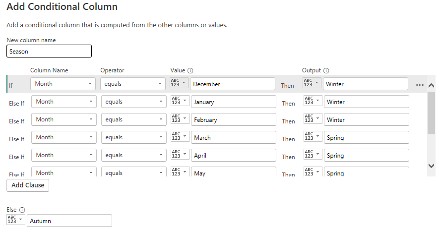

# Retail Sales and Customer Demographics Analysis

### Dataset Overview:

This dataset is a fictional retail landscape, capturing essential attributes that drive retail operations and customer interactions. 
It includes key details such as Transaction ID, Date, Customer ID, Gender, Age, Product Category, Quantity, Price per Unit, and Total Amount. 
These attributes enable a multifaceted exploration of sales trends, demographic influences, and purchasing behaviors.
The dataset can be downloaded from Kaggle via this [link](https://www.kaggle.com/datasets/mohammadtalib786/retail-sales-dataset/data).  The website is a reliable source of data.

**Questions to Explore from this dataset include:

How do customer' age and gender influence their purchasing behavior?
Are there discernible patterns in sales across different periods?
Which product categories hold the highest appeal among customers?
What are the relationships between age, spending, and product preferences?
How do customers adapt their shopping habits during seasonal trends?
Are there distinct purchasing behaviors based on the number of items bought per transaction?
What insights can be gleaned from the distribution of product prices within each category?

#### Preparing the data

The dataset for this project was downloaded into the local system from Kaggle. The dataset is in CSV format. 
To start processing the data, first, the data must be inspected for any form of data anomalies cause this could hinder the analysis. In cleaning the data, I ensured that downloaded data was imported to Powerquerry, to achieve that I used this process:

* launched the powerbi tool
* click on Get data > Text/CSV
* locate the saved downloaded dataset > click OK
A large dialog box with a data table will be displayed, inspect to ensure it's the correct dataset before clicking on Transform data.  
These would import the data into the power-query, where data transformation will occur.

### Cleaning the data

it's important to clean data to increase overall productivity and allow for the highest quality information that would drive decision-making. things to look out for in cleaning data include duplicates, incorrect datatypes, typographical errors, etc.
To clean this data follow these steps:

* click on the transation ID column > right-click on it > select remove duplicates
This will remove all duplicate values. 
Next, check for incorrect spelling and errors.
Also, check the datatypes if they are in their correct format.
on inspecting this data, there were no form of errors and the datatypes are correct, hence there is not much to be done.

### Transform the data
While converting the data, I generated additional columns (months, age group, month number, season) to facilitate my analysis and empower me to extract valuable insights. I implemented the following steps to accomplish this:

To extract the Month column from the date column 
* click on the age column
* click on _Add column_
* select _Extract_ from the ribbon
* click on the _text between delimiters_

These steps would create the Month_no column, After creating the Month_no column, apply A conditional statement which would be used to create the month column. 
When these process have been completed, click on _close & apply_ to apply all changes to the data table in powerBi.
    Extraction        |     Month_no        |    Month_name         |   Loaded 
:--------------------:|:-------------------:|:---------------------:|:--------------------:
      |    |  |  

 To create the Age_group column: 
 * click on the _Table view_ tab on the powerbi
 * click on the _Age_ column
 * click on the _Data Groups_ on the ribbon
 * select _New data_ group
 * input the necessary details on the data dialog box and click OK.

 To create the season column, we make use of the conditional statement just the same process as Month_name.
 

### Visualization

  Front Page               | Age_Gender               | Monthly_Analysis           | Product_categories         
:-------------------------:|:------------------------:|:--------------------------:|:---------------------------:|
  | | | 
    

The visuals from this report consist of four pages, which give answers to the following questions:

* How do customer' age and gender influence their purchasing behavior?
* Are there discernible patterns in sales across different periods?
* Which product categories hold the highest appeal among customers?
* What are the relationships between age, spending, and product preferences?
* How do customers adapt their shopping habits during seasonal trends?
* Are there distinct purchasing behaviors based on the number of items bought per transaction?
* What insights can be gleaned from the distribution of product prices within each category?

